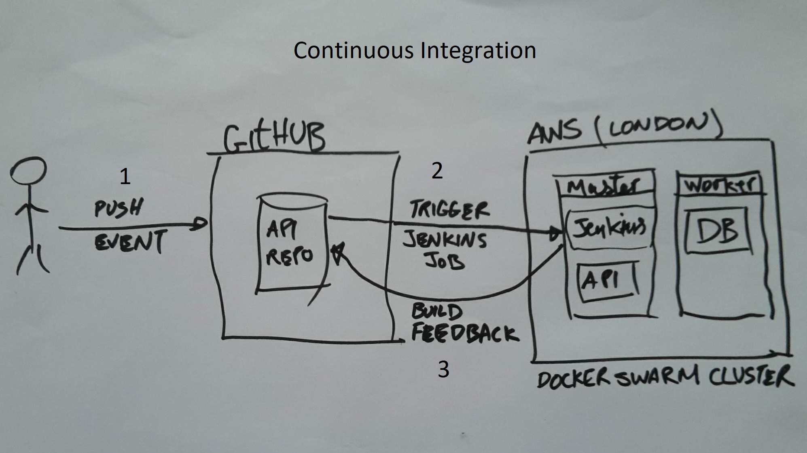
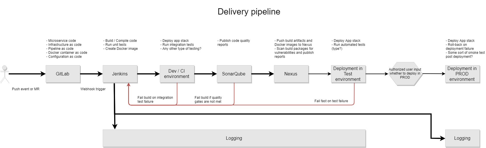

# BCGDV Infrastructure Engineer take home test

## Air Quality API

You are on a venture team that is building a business in the environmental sector. As part of this effort, some engineers have built a small HTTP API in Golang that allows consumers to discover the air quality in their local area. The API receives latitude and longitude coordinates via a HTTP GET request, and subsequently retrieves air quality data for those coordinates by making a further HTTP request to the extneral [Air Visual API](https://airvisual.com/api) . Once the Air Visual response is received, our API returns a JSON response containing the nearest City to the requested coordindates along with the latest air quality index in that location.

- Air quality URL: `/air-quality?lat=50&lon=1`

To aid with analytics and future evolution of the API, each incoming query is stored in a PostreSQL database, and a second external HTTP GET endpoint exposes all the recently queried cities.

- Queried cities URL: `/queried-cities`

As the venture continue and the business evolves, the API's responsibilities will inevitably change. It is also unknown what the future levels of traffic for the API could be, as this is dependent on the success of the venture.

# The Challenge - Part 1

The team have requested your assistance and expertise to help deploy the Air Quality API and associated database to Amazon Web Services.

- Automate deployment of the Air Quality API to AWS
- You may use any tools or services you choose
- Make any code changes you feel are necessary to facilitate the deployment

Challenge tips:
- Think about how your solution will support future evolution and changes to the API
- We value simple solutions over anything complex. Don't overengineer
- This doesn't need to be production-ready code, but be prepared to explain what further changes you'd make if you had more time

AWS Access:
- The [AWS Free Tier](https://aws.amazon.com/free/) should provide you with enough free usage to complete this task. However, if you would like to use any services that fall outside the free tier, then we'll happily reimburse you for this usage (providing it's fair and you haven't just been mining Bitcoin)

# The Challenge - Part 2

The team have also requested your advice for their ongoing development and ownership of the Air Quality API.

Put together a short presentation that details:

- A proposed Continuous Delivery pipeline for the Air Quality API
- Changes that should be made to the API to facilitate its operation in production

Challenge tips:
- Consider security, resiliency, monitoring etc

## Initial Setup
- Install Docker locally from [https://docs.docker.com/install/](https://docs.docker.com/install/)
- Run `start.sh` to start the API
- Visit [http://localhost:5000](http://localhost:5000) in a browser to confirm the API is running
- Run `test.sh` to execute tests

# Changes made _(to the original code repository; .zip)_ by Shahzad Chaudhry
- Added a vagrantfile that creates two Ubuntu VMs which form a docker swarm mode cluster _(1x master and 1x worker)_ for testing API locally
  - Ubuntu 16.04.5 LTS (Xenial Xerus)
  - Docker version 18.06.0-ce _(as of 28/07/2018)_
- Updated .gitignore file to exclude Vagrant logs
- Moved Dockerfile outside of api folder
- Removed .dockerignore file as it is not needed
- Changed orchestration technology from being "docker compose" to "docker swarm mode"
- Added a Jenkins compose file. Jenkins will act as a build & deployment automation engine
- Made substantial changes to docker-compose.yml
  - Changed compose file format from 3 to 3.6
  - Removed "links" as it is deprecated in the latest compose file format
  - No longer publishing DB port numbers as api service connects internally to db over a software defined network
  - Created a network over which all services talk to each other internally
  - Added docker secret management. And so, password from the compose file is removed
  - Added a service called "adminer". This is a web based full-featured database management tool written in PHP
- Updated start.sh which:
  - builds the api docker image and tags it as bcgdv/api:latest
  - Runs both api and db as two docker swarm mode services in a single stack
  - Shows an example how multiple stacks can be started. This means running multiple api versions at the same time
  - This file also lists commands that start Jenkins and Portainer
- Updated test.sh
  - docker-compose is no longer used to run tests. The command in this file shows a stand alone docker container running tests.
- Added "docker-compose.portainer.yml" that can be used to start [Portainer](https://portainer.io/) which is an open-source lightweight management UI which allows you to easily manage your Docker hosts or Swarm clusters.

## Response - Part 1
This section addresses how to deploy code changes in this repository to a runtime environment in AWS. This all needs to be automated in CI / CD fashion; push changes to this repo -> a Jenkins job is triggered automatically to build code -> resultant docker image is then deployed in a runtime in AWS
- Firstly, an AWS infra will need to be setup. See ref no. 2 blow for a link on how to setup a docker swarm cluster using "Docker Community Edition (CE) for AWS". Here are some of the benefits for such a cluster:
  - Native to Docker
  - Skip the boilerplate and maintenance work
  - Minimal, Docker-focused base
  - Self-cleaning and self-healing
  - Logging native to the platforms
- Secondly, A Jenkins instance will need to be installed. This tool will help with build and deployment automation via declarative syntext; pipeline-as-a-code. See start.sh file for instructions on how to start jenkins
- Thirdly, create a webhook in github repo that on a push event will trigger a build in Jenkins. Webhook URL format = "YourJenkinsURL/github-webhook/"

  

  

## Response - Part 2
It is assumed that infrastructure in AWS will be setup using "[Docker for AWS](https://docs.docker.com/docker-for-aws/why/)" tool which is based on AWS CloudFormation templates. This tool creates a Docker Swarm Mode cluster.

The idea here is to keep the DevOps tools and processes as simple as possible with minimum number of technologies invloded:
- **Docker for AWS** - Create required infrastructure in aws
- **Docker Swarm Mode**- Orchestrate docker containers in a swarm clusters

| Arch Principles | Hardware | Software |
| --------------- | -------- | -------- |
| Maintainability | Docker for AWS bootstraps all of the recommended infrastructure. You don’t need to worry about rolling your own instances, security groups, or load balancers when using Docker for AWS | Setting up and using Docker swarm mode functionality for container orchestration is managed across the cluster’s lifecycle when you use Docker for AWS |
| Scalability | Easily scale up / down number of masters & workers using CloudFormation templates | With Docker Swarm Mode as an orchestration technology, services can easily be scaled up or down. All swarm services are internally load balanced |
| Security | The custom Linux distribution _(Alpine based)_ has very small attach surface. Secondly, all ports on ELB are closed by default. Thirdly, no direct SSH access to worker nodes. The custom Linux distribution used by Docker for AWS is carefully developed and configured to run Docker well. Everything from the kernel configuration to the networking stack is customized to make it a favorable place to run Docker. | Only front-end services publish ports _(e.g. 80 or 443)_ via ELB |
| Resiliency | The lifecycle of nodes is managed using auto-scaling groups, so that if a node enters an unhealthy state for unforeseen reasons, the node is taken out of load balancer rotation and/or replaced automatically and all of its container tasks are rescheduled | If a node is replaced, all of its container tasks are rescheduled automatically |
| Persistent data volumes | --- | Cloudstor is a volume plugin built by Docker. It comes pre-installed and pre-configured in Docker swarms deployed through Docker for AWS. Docker swarm mode tasks and regular Docker containers can use a volume created with Cloudstor to mount a persistent data volume |
| Log aggregation | --- | Out of the box, Docker for AWS forwards logs from containers to a native cloud provider abstraction (CloudWatch). An alternative to this could be Elastic Stack (including Filebeat on each node to ship logs to Elasticsearch) |
| Monitoring | An option could be Elastic Stack (including Metricbeat on each node to ship system stats to Elasticsearch) |  An option could be Elastic Stack (including Metricbeat on each node to ship docker container stats to Elasticsearch) |

Stand up DevOps tools and processes so that projects can run Continuous Integration / Continuous Delivery (CI / CD) pipelines:

* `Flow Proxy` - The goal of the [Docker Flow Proxy project](https://github.com/vfarcic/docker-flow-proxy) is to provide an easy way to reconfigure proxy every time a new service is deployed, or when a service is scaled. It does not try to "reinvent the wheel", but to leverage the existing leaders and combine them through an easy to use integration. It uses HAProxy as a proxy and adds custom logic that allows on-demand reconfiguration.
* `Flow Swarm Listener` - The goal of the [Docker Flow Swarm Listener project](https://github.com/vfarcic/docker-flow-swarm-listener) is to listen to Docker Swarm events and send requests when a change occurs. At the moment, the only supported option is to send a notification when a new service is created, or an existing service was removed from the cluster.
* `Sonatype Nexus Repository Manager 3` - Based on CentOS, a free [binary repository manager](https://github.com/sonatype/docker-nexus3) with universal support for popular repository formats such as maven, yum, raw, docker and many other
* `SonarQube` - [SonarQube](https://github.com/SonarSource/sonarqube) provides the capability to not only show health of an application but also to highlight issues newly introduced. With a Quality Gate in place, you can fix the leak and therefore improve code quality systematically
* `Jenkins` - As an extensible automation server, [Jenkins](https://hub.docker.com/r/jenkinsci/blueocean/) can be used as a simple CI server or turned into the continuous delivery hub for any project
* `GitLab Community Edition (CE)` -  [Gitlab](https://github.com/sameersbn/docker-gitlab) is an open source end-to-end software development platform with built-in version control, issue tracking, code review, CI/CD, and more. Self-host GitLab CE on your own servers

# References
1. See https://github.com/shazChaudhry/vagrant repo for instructions on how to create Ubuntu VMs using Vagrant and how to start Portainer for local testing
1. Follow the instructions at https://docs.docker.com/docker-for-aws/ to setup a docker swarm cluster in AWS
1. Follow the instructions at https://github.com/shazChaudhry/docker-elastic to setup an Elastic stack cluster
